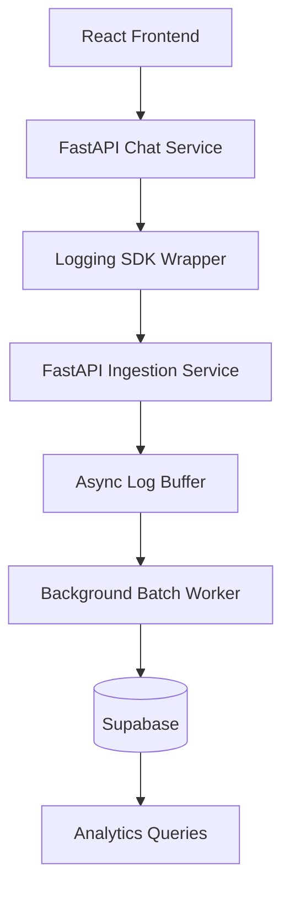
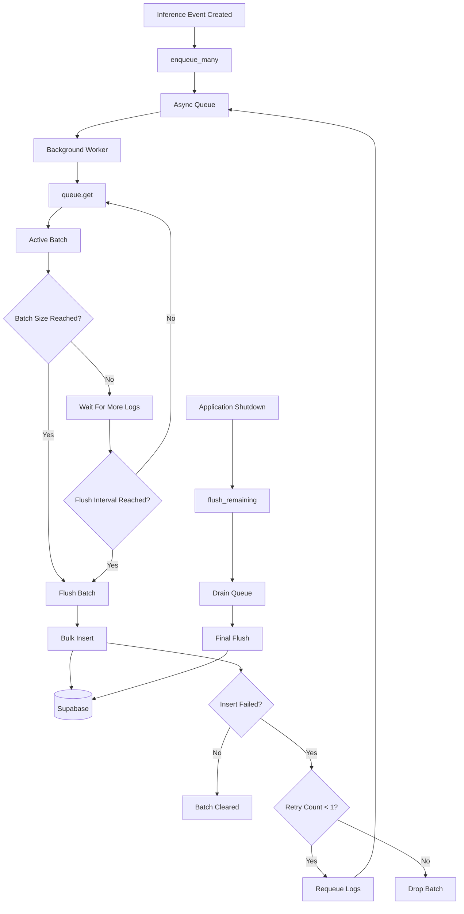

# AI Inference Observability Platform

> observability platform for AI applications that captures, processes, stores, and analyzes LLM inference telemetry in near real-time.

---

## Problem Statement

Modern AI applications generate thousands of inference events every day.

For every LLM call, engineering teams need answers to questions such as:

- Which model is causing latency spikes?
- Which customers consume the most tokens?
- Which prompts frequently fail?
- What is the error rate per provider?
- How much does each conversation cost?
- Which model should we route traffic to?

Most teams start with application logs scattered across services.

As usage grows, these logs become difficult to:

- Search
- Correlate
- Analyze
- Aggregate
- Scale

This project solves that problem by introducing a dedicated AI observability pipeline.

---

# Industry Inspiration

This architecture is inspired by systems built by:

- LangSmith
- Helicone
- Arize Phoenix
- Datadog
- OpenTelemetry

Modern observability systems separate:

1. Data Producers
2. Ingestion Layer
3. Processing Layer
4. Storage Layer
5. Analytics Layer

This separation allows ingestion and storage systems to scale independently.

---

# Goals

## Functional Goals

- Multi-turn AI chatbot
- Inference metadata tracking
- Conversation tracking
- Centralized logging
- Near real-time ingestion
- Historical analytics

## Non-Functional Goals

- Low request latency
- High write throughput
- Scalability
- Reliability
- Extensibility
- Fault tolerance

---

# High-Level System Architecture



---

# Internal Log Processing Architecture

The most important part of the system is the asynchronous log buffering pipeline.

Instead of writing every inference event directly to the database, logs are first buffered in memory and written in batches.

This significantly reduces:

- Database round trips
- Network overhead
- Insert operations
- Request latency

---

## Actual Runtime Flow



---

# Why This Architecture?

A naive implementation writes every log immediately.

```text
Inference Request
        ↓
Database Insert
        ↓
Commit
```

Problems:

- High latency
- Excessive database traffic
- Increased connection usage
- Poor scalability

Instead:

```text
Inference Request
        ↓
Queue
        ↓
Batch
        ↓
Bulk Insert
```

Benefits:

- Fewer write operations
- Better throughput
- Lower request latency
- More efficient database utilization

---

# Core Components

## 1. Chat Service

Responsible for:

- Conversation management
- Context retention
- LLM communication
- Response generation

The chat service is intentionally decoupled from telemetry persistence.

---

## 2. Logging SDK

A lightweight wrapper around LLM providers.

Responsibilities:

- Measure latency
- Capture token usage
- Capture failures
- Capture metadata
- Generate structured inference events

Example:

```python
response = sdk.chat_completion(...)
```

Generated telemetry:

```json
{
  "provider": "openai",
  "model": "gpt-4.1",
  "latency_ms": 842,
  "prompt_tokens": 412,
  "completion_tokens": 201,
  "status": "success"
}
```

---

## 3. Ingestion Service

Central entry point for telemetry events.

Responsibilities:

- Request validation
- Payload parsing
- Metadata enrichment
- Queueing logs

The ingestion layer acts as the boundary between producers and storage.

---

## 4. Async Queue

Implementation:

```python
self.queue = asyncio.Queue()
```

Purpose:

- Absorb traffic spikes
- Decouple API requests from database writes
- Prevent blocking database operations

Incoming logs are immediately accepted and stored in memory.

```text
Producer
     ↓
Async Queue
```

---

## 5. Active Batch

Implementation:

```python
self._active_batch = []
```

Purpose:

- Group multiple logs together
- Prepare logs for bulk insertion

Logs are moved from the queue into the active batch by the background worker.

Example:

```text
Active Batch

[
  log1,
  log2,
  log3
]
```

---

## 6. Background Worker

Runs continuously in the background.

Responsibilities:

- Consume logs from queue
- Build batches
- Flush batches
- Retry failures

Worker lifecycle:

```text
Queue
  ↓
Batch
  ↓
Bulk Insert
```

---

# Batch Flush Strategy

A flush occurs when either condition is met.

## Condition 1: Batch Size Reached

```python
MAX_BATCH_SIZE = 100
```

Example:

```text
100 Logs Collected
        ↓
Flush
```

---

## Condition 2: Flush Timeout Reached

```python
FLUSH_INTERVAL = 1 second
```

Example:

```text
10 Logs Collected
        ↓
1 Second Passed
        ↓
Flush
```

This prevents logs from remaining in memory indefinitely during low traffic periods.

---

# Example Runtime Walkthrough

Configuration:

```python
MAX_BATCH_SIZE = 3
FLUSH_INTERVAL = 5
```

Incoming events:

```text
log1
log2
log3
log4
```

### Step 1

Logs enter the queue.

```text
Queue

[
 log1,
 log2,
 log3,
 log4
]
```

### Step 2

Worker consumes logs.

```text
Active Batch

[
 log1,
 log2,
 log3
]
```

### Step 3

Batch size threshold reached.

```text
Flush Triggered
```

### Step 4

Worker performs bulk insert.

```text
[
 log1,
 log2,
 log3
]
      ↓
Supabase
```

### Step 5

Remaining log stays in memory.

```text
[
 log4
]
```

### Step 6

Timeout expires.

```text
5 Seconds
      ↓
Flush
      ↓
Supabase
```

---

# Storage Layer

## Supabase

Telemetry data is persisted using Supabase.

Reasons:

- Managed PostgreSQL backend
- Built-in API layer
- Authentication support
- Simple deployment
- Developer productivity

The application interacts with Supabase through a dedicated storage layer.

```text
Batch Worker
      ↓
Log Store
      ↓
Supabase
```

---

# Database Design

## conversations

```sql
CREATE TABLE conversations (
    id UUID PRIMARY KEY,
    user_id TEXT,
    created_at TIMESTAMP
);
```

---

## messages

```sql
CREATE TABLE messages (
    id UUID PRIMARY KEY,
    conversation_id UUID,
    role TEXT,
    content TEXT,
    created_at TIMESTAMP
);
```

---

## inference_logs

```sql
CREATE TABLE inference_logs (
    id UUID PRIMARY KEY,

    conversation_id UUID,

    provider TEXT,
    model TEXT,

    latency_ms INTEGER,

    prompt_tokens INTEGER,
    completion_tokens INTEGER,
    total_tokens INTEGER,

    status TEXT,

    error_message TEXT,

    request_preview TEXT,
    response_preview TEXT,

    created_at TIMESTAMP
);
```

---

# Failure Handling

## Database Failure

If a batch write fails:

```text
Batch Insert
      ↓
Failure
      ↓
Retry Once
      ↓
Requeue
```

Implementation:

```python
if item.retry_count < 1:
    item.retry_count += 1
    await self.queue.put(item)
```

Benefits:

- Handles transient failures
- Avoids infinite retry loops
- Preserves ingestion throughput

---

## Graceful Shutdown

Before application shutdown:

```python
await stop_worker()
```

The worker:

1. Stops accepting work
2. Flushes active batch
3. Drains queue
4. Performs final bulk insert

```text
Active Batch
      +
Remaining Queue
      ↓
Final Flush
      ↓
Supabase
```

This minimizes telemetry loss during service termination.

---

# Monitoring Metrics

The platform tracks:

## Throughput

```text
logs/sec
```

## Latency

```text
p50
p95
p99
```

## Reliability

```text
success rate
error rate
```

## Usage

```text
tokens consumed
requests per model
```

## Cost

```text
estimated spend per provider
```

---

# Current Tradeoffs

| Decision | Benefit | Tradeoff |
|-----------|----------|----------|
| Async Queue | Fast ingestion | Memory dependent |
| In-Memory Buffer | Simple implementation | Potential loss on crash |
| Batch Inserts | High throughput | Slight persistence delay |
| Single Worker | Easy debugging | Limited horizontal scale |
| Supabase | Fast development | Less control than self-hosted infrastructure |

---

# Future Evolution

As traffic grows:

```text
SDK
 ↓
Kafka
 ↓
Consumer Group
 ↓
ClickHouse
```

Potential improvements:

- Kafka
- Dead Letter Queues
- Event Replay
- ClickHouse Analytics
- Distributed Tracing
- OpenTelemetry Integration
- Kubernetes Deployment
- Horizontal Scaling

---

# Running Locally

```bash
docker-compose up --build
```

Services:

```text
Frontend          : localhost:3000
Chat API          : localhost:8000
Ingestion API     : localhost:8001
Supabase Backend  : Cloud Hosted
```

---

# Key Engineering Learnings

This project demonstrates:

- Event-driven architecture
- AI observability patterns
- Async processing
- Batching strategies
- Reliability tradeoffs
- Telemetry ingestion pipelines
- Production-inspired AI infrastructure design

Rather than focusing only on chatbot functionality, the project explores the operational challenges involved in running AI systems at scale.